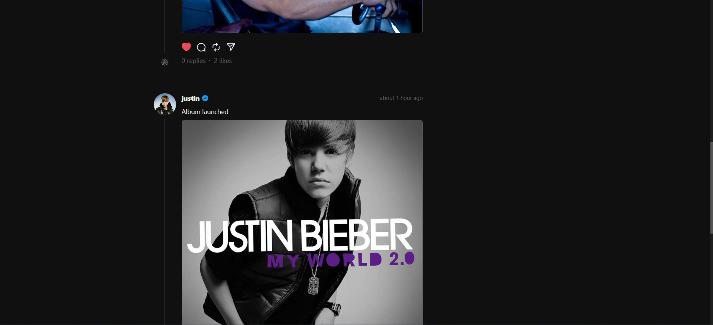

# Mern Project : Threads App

`Open the app` : [Threads-App](https://threads-mern-app.onrender.com)

## 

---


## 



---

### Feature List:

- 🌟 Tech stack: MERN + Chakra UI
- 🎃 Authentication & Authorization with JWT
- 📝 Create Post
- 🗑️ Delete Post
- ❤️ Like/Unlike Post
- 💬 Comment to a Post
- 👥 Follow/Unfollow Users
- ❄️ Freeze Your Account
- 🌓 Dark/Light Mode
- 📱 Completely Responsive

### Setup .env file

```js
PORT=...
MONGODB_URL=...
JWT_SECRET=...
CLOUDINARY_CLOUD_NAME=...
CLOUDINARY_API_KEY=...
CLOUDINARY_API_SECRET=...
```

### Build the app

```shell
npm run build
```

### Start the app

```shell
npm start
```
